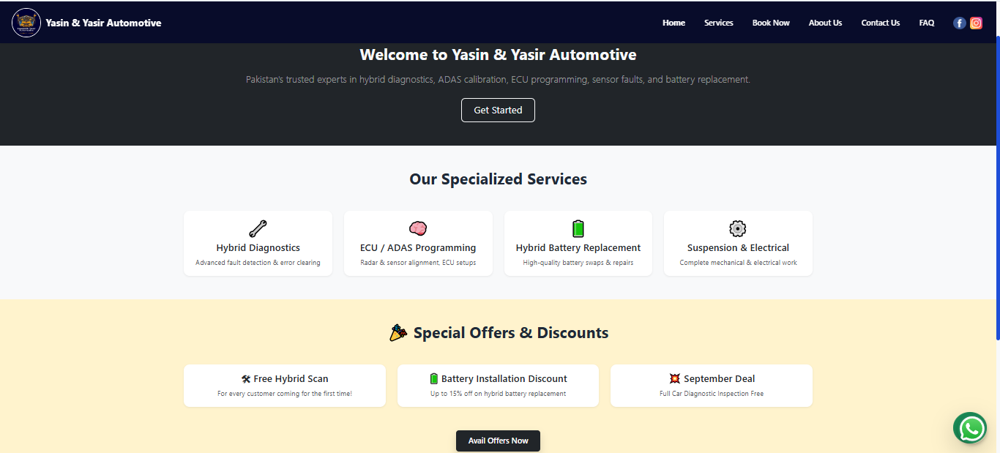
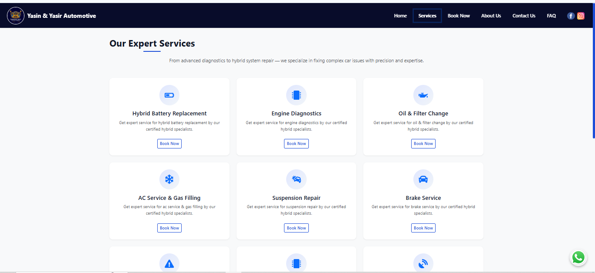
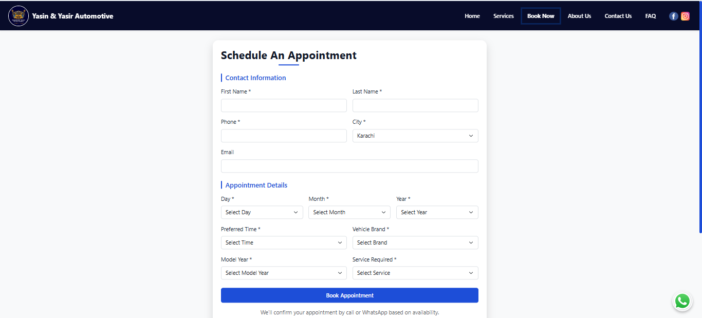
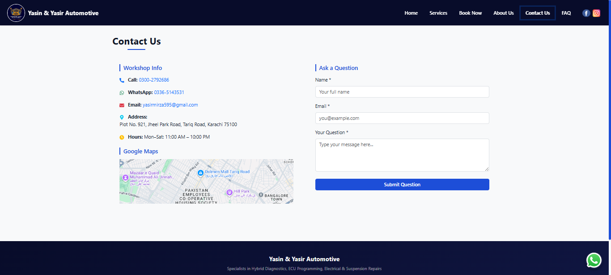
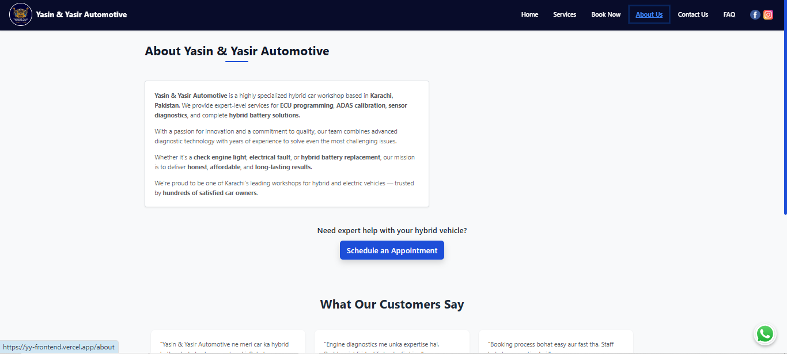
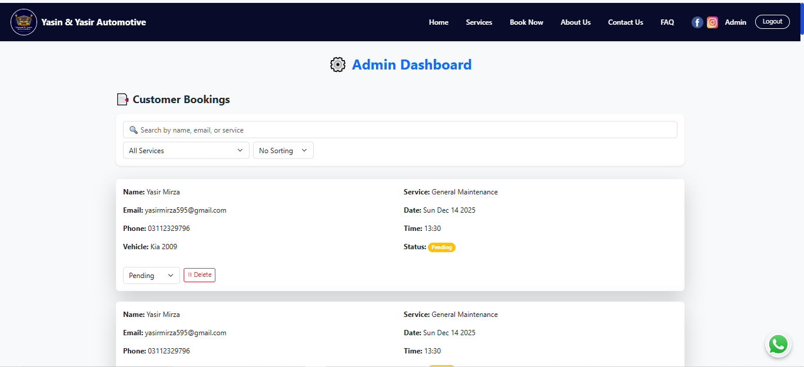

# Y&Y Automotive - Frontend

This is the **frontend web application** for **Y&Y Automotive**, a modern workshop booking and management system.  
Built with **React** and styled using **Tailwind CSS**, it provides customers with a simple and responsive interface to explore services and book appointments online.

---

## 🚀 Live Demo
🔗 [View Live Website](https://yy-frontend.vercel.app)

---

## 📸 Screenshots

### 🏠 Homepage


### 🛠 Services Page


### 📅 Booking Page


### 📞 Contact Page


### ℹ️ About Page


### 📊 Dashboard


---

## 🛠️ Tech Stack
- **React.js**
- **Tailwind CSS**
- **Framer Motion** (animations)
- **Axios** (API calls)
- **Vercel** (deployment)

---

## ✨ Features
- Responsive design (mobile + desktop)
- Services listing with details
- Online booking form with validation
- Integration with backend API
- Smooth animations for better UX

---

## ⚡ Getting Started

### 1. Clone the repo
```bash
git clone https://github.com/yasirmirza595/yy-frontend.git
cd yy-frontend

2. Install dependencies
npm install

3. Run the app
npm start


Now open 👉 http://localhost:3000
 in your browser.

📂 Folder Structure
yy-frontend/
  ├── src/
  │   ├── components/   # Reusable UI components
  │   ├── pages/        # Page-level components
  │   ├── assets/       # Images & static files
  │   └── App.js        # Root app component
  ├── public/           # Public assets
  └── package.json      # Dependencies & scripts

📜 License

This project is licensed under the MIT License.
You are free to use, modify, and distribute it with attribution.

⭐ Developed with ❤️ by Yasir Mirza


git clone https://github.com/yasirmirza595/yy-frontend.git
cd yy-frontend
